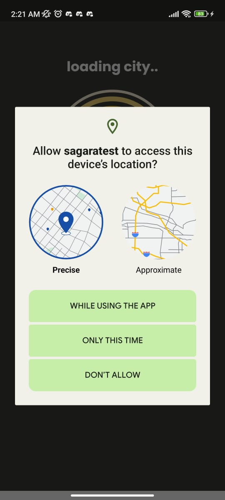
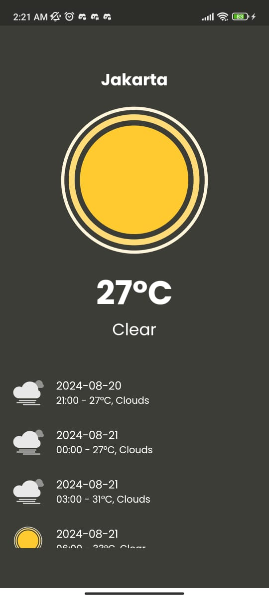
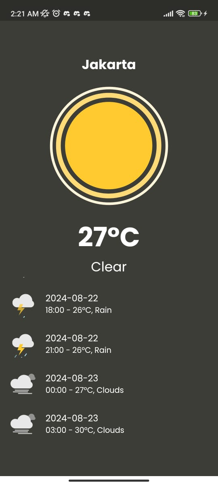

# sagara-mobile-msib-test

1. Buka aplikasi dan nanti akan diarahkan untuk izin akses lokasi
   

2. Setelah akses lokasi diizinkan, akan muncul tampilan cuaca seperti lokasi dan suhu saat itu juga. Lalu terdapat juga list dari cuaca selain hari itu
   

3. Jika scroll ke bawah, nantinya akan muncul list prediksi cuaca selama 3 hari ke depan
   
